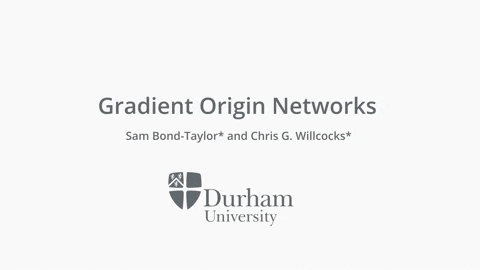

# Gradient Origin Networks

This paper proposes a new type of implicit generative model that is able to quickly learn a latent representation without an explicit encoder. This is achieved with an implicit neural network that takes as inputs points in the coordinate space alongside a latent vector initialised with zeros. The gradients of the data fitting loss with respect to this zero vector are jointly optimised to act as latent points that capture the data manifold. The results show similar characteristics to autoencoders, but with fewer parameters and the advantages of implicit representation networks.

[](https://colab.research.google.com/gist/cwkx/8c3a8b514f3bdfe123edc3bb0e6b7eca/gon.ipynb)<br>

The code is available in [GON.py](GON.py) and licensed under the MIT license. For more information, please visit the [Project Page](https://cwkx.github.io/data/GON/). Here is a [link to the paper](https://arxiv.org/pdf/2007.02798.pdf). 

[](https://www.youtube.com/watch?v=ro7t98Q1gXg)


## Citation
If you find this useful, please cite:
```
@article{bondtaylor2020gradient,
  title={Gradient Origin Networks},
  author={Sam Bond-Taylor and Chris G. Willcocks},
  journal={arXiv preprint arXiv:2007.02798},
  year={2020}
}
```